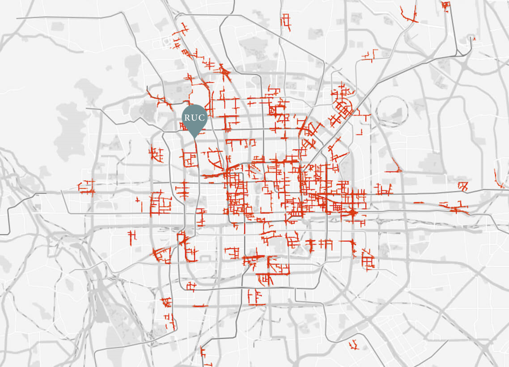
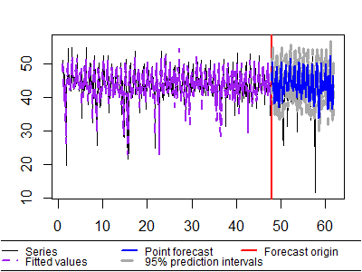
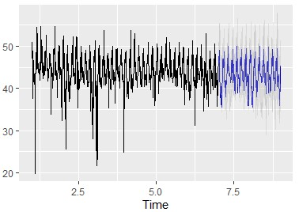
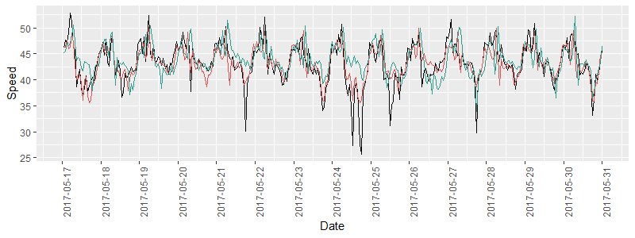

# Ruc traffic prediction

### Dataset

**Q-Traffic Dataset** A large scale traffic dataset collected by Baidu Brain in Beijing China between April 1, 2017 and May 31, 2017. It contains three sub-datasets 

- Query datasets. Map query collected from Baidu Map. It contains about 114 million user queries, each if them records the coordinates of start point, coordinates of destination,  start time and estimated travel time. As is described in the origin paper, the query data have strong potential connection with traffic condition, which is used as auxiliary information in traffic prediction.

- Traffic Speed datasets: It contains 15,073 road segments covering approximately 738.91 km in the same period and same area, from which you can extract the traffic condition data in a specific location over two months, like RUC.

- Road Network datasets. It records the detail information of road network of Traffic Speed dataset, such as road id, start point coordinates, end point coordinate, width, length, speed limit level etc.

### Model Result

The RMSE、EC and MAP of MSARIMA and DSHW by is as following table. 

|         | RMSE                  | MAPE                  | EI                    |
|---------|-----------------------|-----------------------|-----------------------|
| MSARIMA | 3\.511727             | 6\.156587             | 0\.958342             |
| DSHW    | \\textbf\{2\.507141\} | \\textbf\{3\.862283\} | \\textbf\{0\.974319\} |

### Experiment Detail
