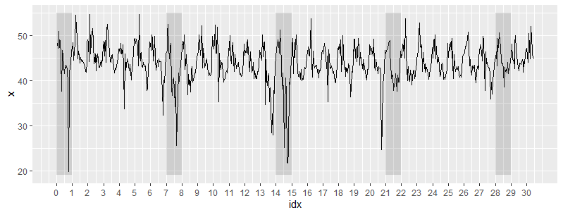
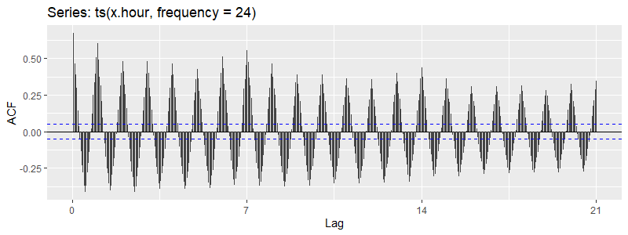
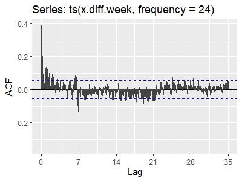
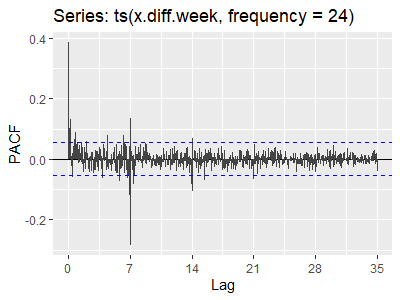
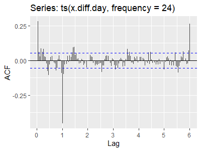

# Ruc traffic prediction ([paper](paper.pdf))

### 数据集 ([link](https://ai.baidu.com/broad/introduction?dataset=traffic))

**Q-Traffic Dataset** 是由百度大脑收集的大规模的交通预测数据集。数据集包括Traffic Speed数据集、Road Network数据集、Query数据集三个部分。

- Query datasets.从百度地图收集的地图查询记录。它包含大约1.14亿个用户查询，每个用户查询是否记录起点坐标，目的地坐标，起点时间和估计的旅行时间。如原文中所述，查询数据与交通状况具有很强的潜在联系，在交通预测中用作辅助信息.

- Traffic Speed datasets: 它包含15,073个路段，覆盖大约738.91公里。我们可以从中提取两个月内特定位置的路况数据，比如中国人民大学。在实验中为方便建模，数据被处理为每小时的平均速度。

- Road Network datasets. 它记录交通速度数据集的道路网络的详细信息，例如道路ID，起点坐标，终点坐标，宽度，长度，限速等级等


### 模型结果


MSARIMA和DSHW的RMSE，EC和MAP如下表所示。

|         | RMSE                  | MAPE                  | EI                    |
|---------|-----------------------|-----------------------|-----------------------|
| MSARIMA | 3.511727              | 6.156587              | 0.958342              |
| DSHW    | **2.507141**          | **3.862283**          | **0.974319**          |

### 实验细节（详细实验过程在论文中）

**MSARIMA**

对于双周期时间序列可以建立模型$\mathrm{ARIMA}(p,d,q)\times(P_1,D_1,Q_1)_{S_1}\times(P_2,D_2,Q_2)_{S_2}$。进一步还需要对模型定阶，


整体上看，路况数据没有递增或递减的时间趋势。到那时由于时间节点较长，数据较为复杂，直接通过时序图并不能直观的看出路况数据的周期性，所以使用自相关系数图来判断。



通过自相关图 我们可以发现数据具有较为复杂的周期性。

（1）日周期。图一中，在每一个横坐标为整数（1，2，3，4）的位置，acf的值都达到波峰，说明路况数据存在很强的日周期性。

（2）周周期。图2以一周为，在第七天（一周之后）的位置，acf达到的波峰比其他波峰都要高，这说明路况数据具有一定的周周期性

```R
ruc_traffic <- read.xlsx("D:/Documents/文档/2_学校/时间序列/大作业/ruc_traffic_prediction/data/ruc_traffic.xlsx",1)
x <- ts(ruc_traffic$Speed,frequency = 96)
Box.test(x)
acf(x,lag.max = 96*28)
```

### 建模过程

#### 周期性提取

（1)消除周周期性：做96*7=672步差分

```R
x.diff.week <- diff(x, 672, 1)
plot(x.diff.week)
acf(x.diff.day,lag.max = 672*5) #5周的
```


从acf图来看消除周周期影响的序列周期性已经被消除了很多，这是因为消除周周期性的同时也会消除一定的日周期性。在横坐标等于7，14，21的地方acf图已经看不出来明显的突变，说明周周期性已经被基本消除了。

但是从五天内的acf图来看，在短期的几天（第一天、第二天、第三天）仍然有较为明显的相关性，这说明日周期性仍然有很大一部分残留。同时，随着天数的增加，相关系数逐渐变小，这也说明了长时间的周期性（周周期性）已经被消除。

（2）消除日周期性

在已经消除周周期性的数据的基础上，再做96步差分，消除日周期性。



通过差分后的acf图可以看出，除了第一天acf骤降之外，其余部分没有明显的骤增或骤降，说明短期的日周期性也基本消除掉了。

```R
x.diff.week <- diff(x, 672, 1)
plot(x.diff.week)
acf(x.diff.week,lag.max = 96*35) #5周的
acf(x.diff.week,lag.max = 96*5)

x.diff.day = diff(x.diff.week, 96, 1)
acf(x.diff.day,lag.max = 96*5)
```

#### 定阶

首先确立无周期性的短期相关模型部分。对于依次进行24步差分和168步差分之后的序列，观察其acf图和pacf图，发现在24阶以内自相关系数和偏自相关系数均不截尾，考虑用低阶的ARMA(1,1)来提取短期自相关信息。

对于日周期自相关特征，观察以延迟24阶、48阶等以周期长度为单位的自相关系数和偏自相关系数，发现自相关系数在除延迟24阶显著非0之外，以周期长度为单位的自相关系数都在两倍标准差以内，而偏自相关系数有一定的截尾特征但不明显，所以采用以24步为周期ARIMA(0,1)[24]提取日周期的自相关信息。

周周期的自相关特征可以通过只做了168步差分的序列的自相关系数和偏自相关系数判断。画出只消除周周期的序列的自相关图和偏自相关图），观察以延迟168阶、336阶等以168为单位的自相关系数和偏自相关系数，我们发现自相关系数在延迟168阶以后都落入了两倍标准差内，偏自相关系数也在延迟504阶后落入两倍标准差内，所以可以认为周周期的自相关特征是自相关系数截尾、偏自相关系数也截尾的，可以考虑用ARMA(3,0)[168]提取周周期自相关特征。

最终确定，我们要拟合的模型是\\times(0,0,1)_{24}\\times(3,0,0)_{168})

```R
msarima(x.hour, orders=list(ar=c(1,0,3),i=c(0,0,0),ma=c(1,1,0)),lags=c(1,24,168),h=24*7*2,holdout=TRUE,FI=F)
```
通过R的系数估计，模型为：

(1+0.3304B^{24})}{(1+0.6945B)(1+0.2026B^{168}+0.0214B^{336}+0.7688B^{504})}\\varepsilon_t)


### DSHW 双季节Holt-Winters指数平滑

+(1-\\alpha)(a_{t-1}+b_{t-1})\\\\b_t&=\\beta(a_t-a_{t-\\Pi_1})+(1-\\beta)b_{t-1}\\\\s_t&=\\gamma(x_t/a_tr_t)+(1-\\gamma)s_{t-\\pi_1}\\\\r_t&=\\delta(x_t/a_ts_t)+(1-\\delta)r_{t-\\pi_1}\\\\\\end{aligned})

对于人民大学东门外主干道车流的每小时平均速度数据来说，设置日周期长度𝜋1=24，周周期长度𝜋2=24*7=168。可以设计算法，通过最小化预测均方误差，找到系数𝛼, 𝛽, 𝛾, 𝛿的估计值，拟合车流速度数据。在R软件中`forecast`包提供了`dshw()`函数，可以按照这样的思路拟合模型。得到的拟合结果如下表。

| **参数**  | 𝛼 | 𝛽 | 𝛾 | 𝛿 |
|-----------------|-----------|----------|-----------|-----------|
| **估计值** | 0.0133   | 0.0020  | 0.0230   | 0.2652   |


```R
dshw(x.hour.train, period1 = 24, period2 = 24*7)
```

